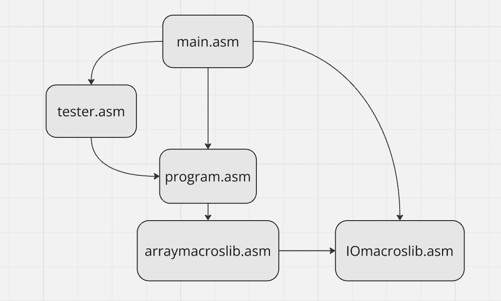
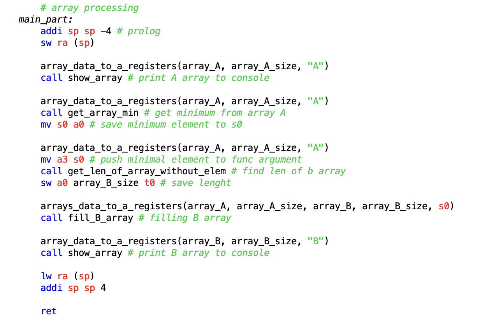
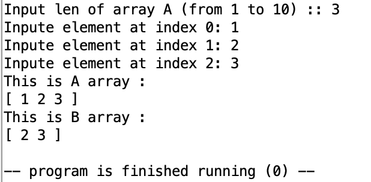
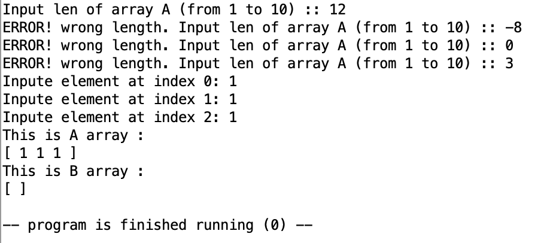
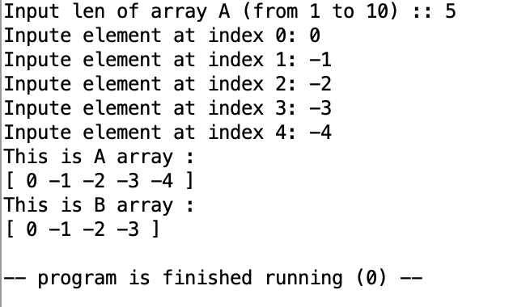
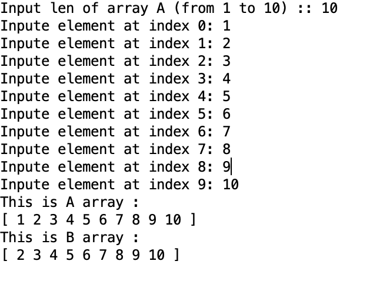
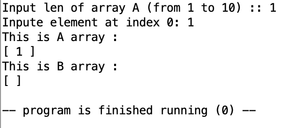
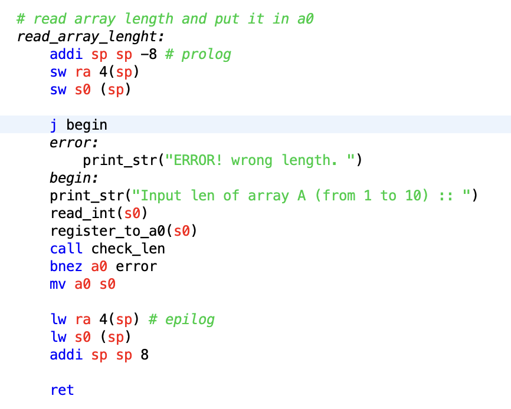
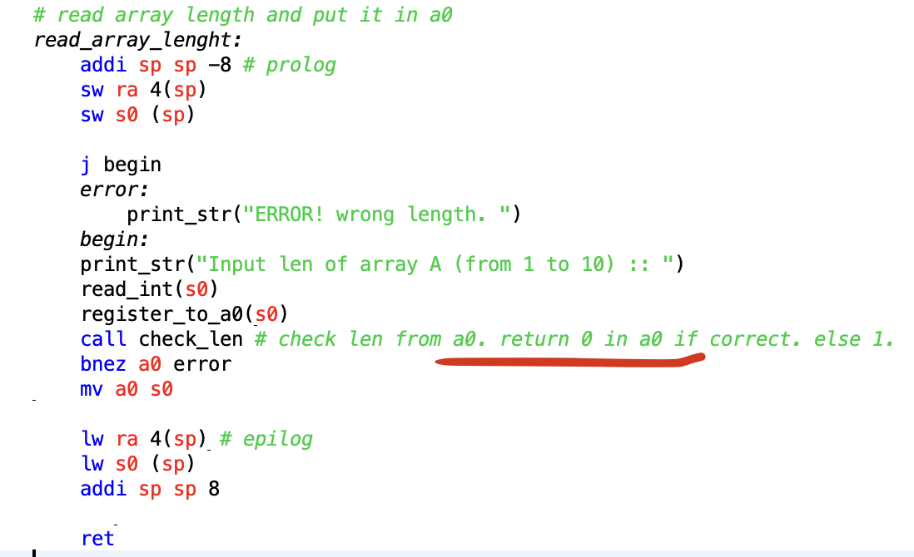

# Первое индивидуальное домашнее задание по курсу Архитектура Вычислительных Систем

## Юридическая информация: 

В файле [req-task-arrays.pdf](req-task-arrays.pdf) лежат требования к выполнению задания

В файле [task-arrays.pdf](task-arrays.pdf) лежат индивидуальные задания по вариантам

Мне достался вариант номер 13


    13. Сформировать массив B из элементов массива A, за исключением
    элементов, значения которых совпадают с минимальным элемен-
    том массива A.


## Структура решения:



в файле ```main.asm``` выбирается будут ли проводится автотесты или массив будет заполнятся из терминала.

в файле ```tester.asm``` данные тестов вводятся автоматически и вызывается программа

в файле ```program.asm``` вводятся данные из терминала и вызываются функции из ```arraymacroslib.asm``` для обработки массивов.

в файле ```arraymacroslib.asm``` находятся макросы и подпрограммы для заполнения и обработки массивов

в файле ```IOmacroslib.asm``` находятся макросы для работы с вводом/выводом

## Парадигма

Вызов подпрограмм я писал в соответствии с [конвенцией](https://www.cs.sfu.ca/~ashriram/Courses/CS295/assets/notebooks/RISCV/RISCV_CALL.pdf)

Интересней работа макросов. Я спросил у существовании подобной конвенции для макросов у моего семинариста по курсу Виденина С.А.

На что он рассказал мне два подхода:

    Подход преподавателя МГУ Курячева Г.В. :
    При вызове макросов передаются регистры с аргументами. Внутри макрос перекладывает аргументы в регистры типа a и вызывает подпрограмму сам

    Подход нашего лектора Легалова А.И. :
    При вызове макросов передаются регистры с аргументами. Внутри макрос только перекладываеи аргументы в регистры типа а. И после вызова макроса уже вызывается сама подпрограмма.

Сергей Александрович сказал что второй вариант приоритетнее, потому макросы становятся много функциональными.

Действительно, если смотреть на мой файл ```program.asm```



видно как я много раз вызываю один и тот же макрос

## Выполнение критериев

Пойдем подряд  и я докажу что они выполняются:

### 4-5 баллов

#### *Приведено решение задачи на ассемблере. Ввод данных осуществляется с клавиатуры. Вывод данных осуществляется на дисплей.*

Это правда

#### *В программе должны присутствовать комментарии, поясняющие выполняемые действия.*

Да, везде прописаны поясняющие комментарии

#### *Допускается использование требуемых подпрограмм без параметров и локальных переменных.*

Требуемыми подпрограммами являются ввод массива, вывод массива и построение массива В. Эти мои подпрограммы не требуют аргументов.

#### *В отчете должно быть представлено полное тестовое покрытие. Приведены результаты тестовых прогонов. Например, с использованием скриншотов.*

примеры тестов:


Это базовый пример


Этот пример примечателен тем, что показывает что может выводится пустой массив, а также что проверка на длину массива А работает корректно


Этот пример показывает, что программа корректно обрабатывает отрицательные числа


Этот пример показывает, что программа корректно справляется при максимальной длине массива.


Этот прогон показываент корректную работу для массива длины 1.

### 6-7 баллов

#### *В программе необходимо использовать подпрограммы с передачей аргументов через соответствующие регистры, определяемые конвенцией по их использованию. При нехватке этих регистров для их хранения необходимо использовать стек.*

Так и делаю, и [конвенцию](https://www.cs.sfu.ca/~ashriram/Courses/CS295/assets/notebooks/RISCV/RISCV_CALL.pdf) соблюдаю)



Пример: есть эпилог и пролог.

#### *Локальные переменные допускается размещать в свободных регистров, при нехватке которых необходимо их сохранять на стеке. Или сразу все локальные переменные отображать на стек.*

Да, пользуюсь свободно t регистрами которые не нужно сохранять. Иногда использую S регистры предварительно сохранив предыдущее значение на стек, тем самым сделав его свободным. (см. предыдущий скрин)

#### *В местах вызова функции добавить комментарии, описывающие передачу фактических параметров и перенос возвращаемого результата. При этом необходимо отметить, в каких регистрах или где на стеке отображаются соответствующие фактические параметры.*

Да, выполняется



и пример

#### *Информацию о проведенных изменениях отобразить в отчете на- ряду с информацией, необходимой на предыдущую оценку.*

Вот и привожу.

### 8 баллов

#### *Разработанные подпрограммы должны поддерживать многократное использование с различными наборами исходных данных, включая возможность подключения различных исходных и результирующих массивов. То есть, поддерживать работу с формальными и фактическими параметрами.*

