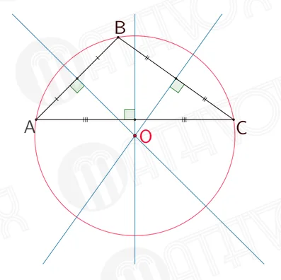
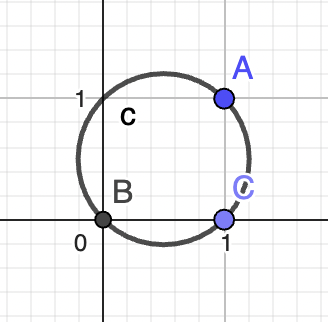
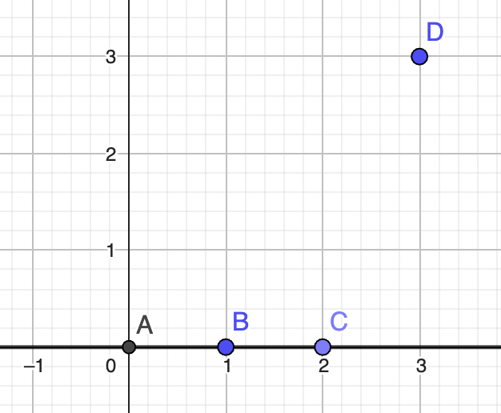

# Второе индивидуальное домашнее задание по АВС

## Юридическая информация:

Вова Бабушкин, БПИ 237

В файле [req-task-float.pdf](req-task-float.pdf) лежат требования к выполнению задания

В файле [task-float.pdf](task-float.pdf) лежат задачи по вариантам

Мне достался вариант номер 25

```
25. Разработать программу, решающую вопрос о принадлежности за-
данных 4-х точек одной окружности.
```

весь код и этот отчет в формате ```README.md``` можно найти по [ссылке](https://github.com/Babushkin05/HSE-ABC-OS-course/tree/main/IDZ2)


## Идея решения:

Из школьной геометрии известно, что построить окружность можно по трем точкам. Поэтому основная идея моего решения: 
***Строим окружность их первых трех точек, и проверяем лежит ли четвертая точка на окружности.***


### Как я строю окружность по трем точкам:

Как известно из школьного курса геометрии, описанная окружность в треугольнике лежит на точке пересечения серединных перпендикуляров треугольника.



Вообще достаточно найти пересечение любых двух из них, поэтому я так и делал

#### Я две стороны задавал линейными графиками на плоскостях

если есть две точки: $(x_0, y_0)$ и $(x_1, y_1)$

то функция будет иметь вид

$y=kx+c$

где $k=\frac{y_1-y_0}{x_1-x_0}$

а $c=y_0-kx_0$

#### Для каждой из них, находил перпендикуляр проходящий через среднюю точку

Для линии $y=kx$, перпендикулярной будет линия $-\frac{x}{k}$

Зная $x_0$ можно найти и константу смещения

$kx_0+c=-\frac{x}{k}+c'$

$c'= kx_0+c + \frac{x}{k}$

#### Нахожу пересечение перпендикуляров

Это и будет центром окружности, через него и точку треугольника нахожу радиус окружности 

#### Проверяю находится ли четвертая точка на этой окружности

Чтобы она находилась на ней, нужно чтобы расстояние до центра окружности было равно радиусу

```
Перед тем как проводить эти действия провожу проверку входных данных. 
1) Если любая точка введена два раза, то значит у нас всего 3 точки, и по ним точно можно провести окружность.
2) Если у нас три точки лежат на одной прямой по ним точно нельзя построить окружность.
3) Меняю точки между собой, так как работа с прямыми параллельные осям трудна из-за того, что они задаются не видом y=kx+b, а значит и будут проблемы при счете.
4) Провожу проверку на то что введен прямоугольник со сторонами параллельными входным данным (по прошлому пункту с такми трудно работать), и если введен он то построить можно (вокруг любого прямоугольника можно провести окружность)
```

### Ссылка на источник информации с описанием метода решения - придумал сам.

## Описание тестовых прогонов с представлением информации о ре- зультатах тестирования.

```
type 0 if you want run tests, or something else to fill array from terminal :: 0

for this data:
x0 = 0.0, y0 = 0.0, x1 = 0.0, y1 = 0.0, x2 = 0.0, y2 = 0.0, x3 = 1.0, y3 = 1.0
the answer is yes! because input has same points

for this data:
x0 = 0.0, y0 = 0.0, x1 = 0.0, y1 = 1.0, x2 = 1.0, y2 = 0.0, x3 = 1.0, y3 = 1.0
the answer is yes! because this is triangle

for this data:
x0 = 0.0, y0 = 0.0, x1 = 1.0, y1 = 0.0, x2 = 2.0, y2 = 1.0, x3 = -1.0, y3 = 2.0
the answer is yes!
x: 0.5
y: 1.5
r: 1.5811388300841898

for this data:
x0 = 0.0, y0 = 0.0, x1 = 1.0, y1 = 1.0, x2 = 0.0, y2 = 2.0, x3 = -1.0, y3 = 1.0
the answer is yes!
x: 0.0
y: 1.0
r: 1.0

for this data:
x0 = 0.0, y0 = 0.0, x1 = 1.0, y1 = 0.0, x2 = 0.0, y2 = 1.0, x3 = 2.0, y3 = 2.0
the answer is no(

for this data:
x0 = 0.0, y0 = 0.0, x1 = 0.0, y1 = 1.0, x2 = 0.0, y2 = 2.0, x3 = 3.0, y3 = 3.0
the answer is no(

-- program is finished running (0) --
```

### рассмотрим каждый тест подробнее:

***1 тест***
$x_0 = 0.0, y_0 = 0.0, x_1 = 0.0, y_1 = 0.0, x_2 = 0.0, y_2 = 0.0, x_3 = 1.0, y_3 = 1.0$
Тест подходит потому что ввели одинаковые точки, а значит точно можно построить окружность, например такую



***2 тест***

$x_0 = 0.0, y_0 = 0.0, x_1 = 0.0, y_1 = 1.0, x_2 = 1.0, y_2 = 0.0, x_3 = 1.0, y_3 = 1.0$

Тест подходит, потому что введен квадрат (прямоугольник)


***3 тест***

$x_0 = 0.0, y_0 = 0.0, x_1 = 1.0, y_1 = 0.0, x_2 = 2.0, y_2 = 1.0, x_3 = -1.0, y_3 = 2.0$

Введена трапеция, вокруг нее можно построить окружность


$x: 0.5,
y: 1.5,
r: 1.5811388300841898$

***4 тест***

$x_0 = 0.0, y_0 = 0.0, x_1 = 1.0, y_1 = 0.0, x_2 = 2.0, y_2 = 1.0, x_3 = -1.0, y_3 = 2.0$

Введен квадрат под углом, вокруг него можно построить окружность 


$x: 0.0,
y: 1.0,
r: 1.0$

***5 тест***

$x0 = 0.0, y0 = 0.0, x1 = 1.0, y1 = 0.0, x2 = 0.0, y2 = 1.0, x3 = 2.0, y3 = 2.0$


Построить окружность невозможно

***6 тест***

$x_0 = 0.0, y_0 = 0.0, x_1 = 0.0, y_1 = 1.0, x_2 = 0.0, y_2 = 2.0, x_3 = 3.0, y_3 = 3.0$



три точки лежат на одной прямой, нельзя построить окружность

### Структура решения


В файле ```main.asm``` запускается сама команда и пользователь решает запустить автотесты или проверить самому

В файле ```tester.asm``` тестовые данные загружаются в память и запускается программа

В файле ```program.asm``` работает сама программа считает все по вышеописанному алгоритму

В файле ```geomlib.asm``` находятся функции для работы с планиметрическими данными (найти расстояние, построить перпендикуляр и тд)

В файле ```iolib.asm``` находятся макросы для чтения и записи данных в консоли

## Парадигма

Вызов подпрограмм я писал в соответствии с [конвенцией](https://www.cs.sfu.ca/~ashriram/Courses/CS295/assets/notebooks/RISCV/RISCV_CALL.pdf)

Интересней работа макросов. Я спросил у существовании подобной конвенции для макросов у моего семинариста по курсу Виденина С.А.

На что он рассказал мне два подхода:

    Подход преподавателя МГУ Курячева Г.В. :
    При вызове макросов передаются регистры с аргументами. Внутри макрос перекладывает аргументы в регистры типа a и вызывает подпрограмму сам

    Подход нашего лектора Легалова А.И. :
    При вызове макросов передаются регистры с аргументами. Внутри макрос только перекладываеи аргументы в регистры типа а. И после вызова макроса уже вызывается сама подпрограмма.

Сергей Александрович сказал что второй вариант приоритетнее, потому макросы становятся много функциональными.

## Критерии на 4-5

### Приведено решение задачи на ассемблере. Ввод данных осуществляется с клавиатуры. Вывод данных осуществляется на дисплей

выполняется

### В программе должны присутствовать комментарии, поясняющие выполняемые действия.

выполняется

### Допускается использование требуемых подпрограмм без параметров и локальных переменных.

Да, все подпрограммы принимают аргументы в регистрах типа ```a```, если регистры будут заполнены мусором, программа не упадет

### В отчете должно быть представлено полное тестовое покрытие. Приведены результаты тестовых прогонов. Например, с использованием скриншотов

Описал выше

## 6–7 баллов

### В программе необходимо использовать подпрограммы с передачей аргументов через параметры, что обеспечивает их повторное иcпользование с различными входными аргументами. При нехватке регистров, используемых для передачи параметров, оставшиеся параметры передавать через стек.

Так и делаю, по конвенции. Стек не понадобился.

### В программе необходимо использовать подпрограммы с передачей аргументов через параметры, что обеспечивает их повторное использование с различными входными аргументами. При нехватке регистров, используемых для передачи параметров, оставшиеся параметры передавать через стек.

Использую временные регистры типа ```t```, при их нехватке регистры типа ```s``` сохраняю на стек, и в конце функции загружаю обратно.

### В местах вызова функции добавить комментарии, описывающие передачу фактических параметров и перенос возвращаемого результата. При этом необходимо отметить, какая переменная или результат какого выражения соответствует тому или иному фактическому параметру.

Так и делаю

### Информацию о проведенных изменениях отобразить в отчете наряду с информацией, необходимой на предыдущую оценку.

Этим и занимаюсь.

## 8 баллов

### Разработанные подпрограммы должны поддерживать многократное использование с различными наборами исходных данных, включая возможность подключения различных исходных и результирующих массивов.

Программы действительно поддерживают многократное использование, однако не принимают в аргументы никаких массивов. Предположу, что это требование осталось с прошлого идз.

### Реализовать автоматизированное тестирование за счет создания дополнительной тестовой программы, осуществляющей прогон подпрограмм, осуществляющих вычисления для различных тестовых данных (вместо их ввода). Осуществить прогон тестов обеспечивающих покрытие различных ситуаций. 

Об этом написал выше

### Для дополнительной проверки корректности вычислений осуществить аналогичные тестовые прогоны с использованием существующих библиотек и одного из языков программирования высокогоуровня по выбору: C, C++, Python

Воспользовался библиотекой ```sympy```, код писал в юпитерноутбуке для удобсктва, его можно найти по [ссылке](IDZChecking.ipynb)

В функции я создавал обьект круга, пересекал его с четвертой точкой и смотрел пересеклось ли

### Добавить информацию о проведенных изменениях в отчет

Это и делаю


## 9 баллов

### Добавить в программу использование макросов для реализации ввода и вывода данных. Макросы должны поддерживать повторное использование с различными массивами и другими параметрами

Да, в файле ```iolib``` у меня как раз все оформлено макросами

## Допускается обертыванием макросами уже разработанных подпрограмм

Обертываю по идее, и которой описал в блоке ```Парадигма```

## 10 баллов

### Программа должна быть разбита на несколько единиц компиляции. При этом подпрограммы ввода–вывода должны составлять унифицированные модули, используемые повторно как в программе, осуществляющей ввод исходных данных, так и в программе, осуществляющей тестовое покрытие.

Да, так и сделал. Подробней о разббитии написал в блоке ```Структура```

### Макросы должны быть выделены в отдельную автономную библиотеку

Да, об этом уже написал в критериях на 9 баллов. Однако макросы обертки для геометрии я оставил в том файле, для читаемости.

### Расширить отчет, дополнив его новыми данными

Доделал!