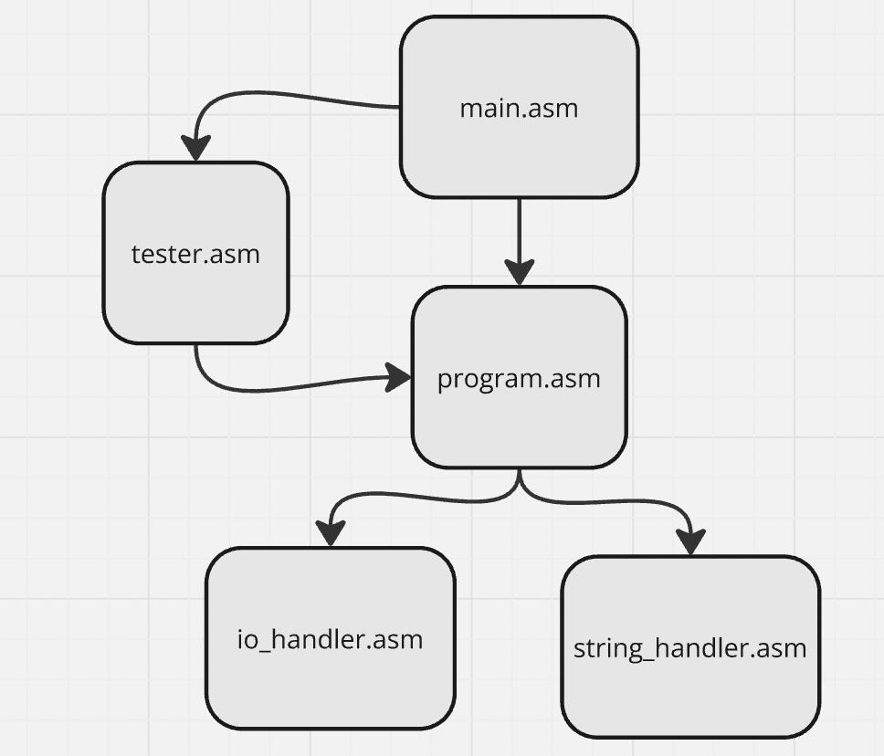
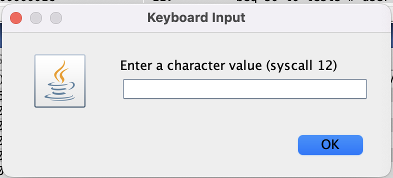

# Третье индивидуальное домашнее задание по АВС

решение варианта можно найти по [ссылке](https://github.com/Babushkin05/HSE-ABC-OS-course/tree/main/IDZ3)

## Юридическая информация

Бабушкин Владимир Александрович, БПИ 237

вариант идз: 11

```
Разработать программу вычисления отдельно количества гласных и согласных букв в ASCII–строке.
Вывод результатов организовать в файл (используя соответствующие преобразования чисел в строки).
```
- Важно отметить, что не написано для какого языка должна работать программа, поэтому я написал для английского

[требования к работе](req-task-strings.pdf)

[варианты](task-strings.pdf)

## Решение


Я считываю строку из файла, для каждого символа строки я вызываю функцию ```letter_type```, которая определяет является ли символ гласной, согласной буквой или вообще что-то другое

Определяет она это, сравнивая символ со всеми гласными и со всеми согласными

Далее создаю из этих чисел строку вида:

```
number of vowels: %vowels_count
number of consonants: %consonants_count
```

и записываю ее в файл

Это базовый функционал, позже была добавлена возможность читать уже тестовые данные и выводить ответ в консоль, а не в файл

## Тесты

[beatles.txt](beatles.txt) - текст песни Let it be 

моя программа выдает такой результат:

```
number of vowels: 0307
number of consonants: 0498
```

[qeen.txt](qeen.txt) - текст песни Bohemian Rhapsody
```
number of vowels: 0622
number of consonants: 0782
```

[holy bible.txt](holy%20bible.txt) - Библия на английском

Поскольку в условиях указано, что программа должна корректно обрабатывать до 10 кБ данных, программа обрабатывает первые 10кБ из файла (вся Библия занимает 4+Мб)

Получается для первых 10Кб Библии:
```
number of vowels: 3023
number of consonants: 4507
```

*Стоит отметить, что тестовые программы довольно увесистые, поэтому их запуск занимает продолжительное время. Хоть Асимптотика программы линейная, но большая константа из-за проходов по заготовленным строкам значительно замедляет алгоритм.*

## Архитектура



[main.asm](main.asm`) - программа запускающая другие файлы

[tester.asm](tester.asm) - программа запускающая тесты

[program.asm](program.asm) - выполняет всю логику по условию

[io_handler.asm](io_handler.asm) - состоит из 2 ключевых программ: подсчет гласных/согласных и составление строки

[string_handler.asm](string_handler.asm) -  состоит из 2 ключевых программ: читает файл, записывает в файл

также еще есть библиотека с макросами [macro-syscalls.m](macro-syscalls.m). Я взял его из предложенных преподователем файлов и добавил нужные макросы.

## Удовлетворяемость критериям

### 4-5

### Приведено решение программы на ассемблере. Программа из файла читает данные. Результаты записываются в другой файл.

Конечно

### Все изменяемые параметры программы вводятся с консоли.

Верно

### В программе присутствуют комментарии, поясняющие выполняе- мые ей действия.

Да, пример из файла [program.asm](program.asm)

```python
        # count vowels and consonants in file, 
		# takes string adres in a0 and strin size in a1, 
		# return vowels count in a0 consonants count in a1
		call counting_vowels_and_consonants
```

### Обработка данных, полученных из файла сформирована в виде отдельной подпрограммы.

Да, с помощью подпрограммы ```counting_vowels_and_consonants```


### В подкаталоге данных присутствуют файлы, используемые для те- стирования.

Да, подробнее смотрите в пункте тесты

### Буфер для текста программы имеет фиксированный размер размером не менее 4096 байт, допускающий ввод без искажений только тексты, ограниченные этим размером.

А вот тут неправда, потому что сделал по условиям следующих баллов, где сложнее

### При чтении файла размером, превышающим размер буфера, не должно происходить падения программы. Программа должна кор- ректно обработать введенный «урезанный» текст

Да, это тоже рассмотрел в разделе тесты

### Сформирован отчет с результатами тестовых прогонов и описани- ем используемых опций компиляции, проведенных модификаций ассемблерной программы.

Пример компиляции:

```
type 'Y' for start autotest, or something else to open your file:: **** user input : Y

Do you want to print output into console? (Y/N):: **** user input : Y
number of vowels: 0307
number of consonants: 0498
Do you want to print output into console? (Y/N):: **** user input : Y
number of vowels: 0622
number of consonants: 0782
Do you want to print output into console? (Y/N):: **** user input : Y
number of vowels: 3023
number of consonants: 4507
```

Остальное описал уже

### 6-7

### Внутри функций необходимо использовать регистровые или ло- кальные (при нехватке) переменные.

Вот это я не соблюдаю в двух местах:

первое:

```python
# takes letter in a0, returns letter type: 1 - vowel, 2 - consonant, 0 - other
	letter_type:
		mv t5 a0
		.data
			vowels: .asciz "eyuioaEYUIOA" 
			.align 2 
			consonants: .asciz "qwrtpsdfghjklzxcvbnmQWRTPSDFGHJKLZXCVBNM"
		.text
		la t0 vowels
```

Для проверки на типо создаю в статической памяти две строки

Потому что если пытать обойти без статики, пришлось бы кодом сравнивать с каждой из 52 букв, а это очень массивный код бы получился

второе:

```python
.data
	er_name_mes: .asciz "Incorrect file name\n"
	er_read_mes: .asciz "Incorrect read operation\n"

	file_name: .space NAME_SIZE	# filename
	strbuf:	.space TEXT_SIZE # buffer for text part
```

Имя файла и буфер я храню в статической памяти, потому что такой метод использовался в разбираемых на семинарах примерах, и я решил что такая практика удачная.

В остальных случаях да.

### Для чтения текста из файла реализовать буфер ограниченного раз- мера, равного 512 байтам. При этом программа должна читать фай- лы размером до 10 килобайт.

Да, именно так у меня действует считывание в файле [io_handler.asm](io_handler.asm)

### Реализовать ввод исходных данных, их обработку, вывод результа- тов через соответствующие подпрограммы. Подпрограммы должны получать необходимые им данные через параметры в соответствии с принятым соглашением о передаче параметров.

Да, подробнее расписал в разделе архитектуры

И [конвенцию](https://www.cs.sfu.ca/~ashriram/Courses/CS295/assets/notebooks/RISCV/RISCV_CALL.pdf) соблюдаю, передаю все аргументы через регистры типа ```a``` и в них же возвращаю результаты, а все используемые регистры типа ```s``` и ```ra``` (если запускаю подрограмму) сохраняю на стек, и загружаю в конце функции.

### Возвращаемые из подпрограмм значения должны возвращаться че- рез параметры в соответствии с общепринятыми соглашениями.

См. предыдущий пункт

### Расширить отчет, дополнив его новыми данными.

это и делаю)

### 8

### Добавить в программу возможность дополнительного вывода ре- зультатов на консоль. Выводить или нет решает пользователь от- вечая «Y» или «N» на соответствующий вопрос компьютерной про- граммы. Данная возможность полезна при быстром отображении коротких данных. Вывод программы при этом должен полностью соответствовать выводу результатов в файл.

Да, привел пример в результате компиляции программы в предыдущих пунктах

### Реализовать дополнительную тестовую программу которая осуществляет многократный вызов процедур, обеспечивающих ввод файлов, их обработку и вывод для различных исходных данных, располо- женных в каталоге с исходными тестовыми данными.

Да, тоже есть в том же примере компиляции

### Расширить отчет, дополнив его новыми данными.

Работаем.
### 9

### Добавить в программу использование макросов для реализации ввода, вывода, и обработки данных. Макросы должны поддержи- вать повторное использование с различными массивами и другими параметрами. Внутри макросов должны быть расположены вызо- вы соответствующих подпрограмм.

Да, написал про них уже в разделе архитектуры

### Реализовать дополнительную тестовую программу, которая вызы- вает выполняемые подпрограммы через макросы, реализуя ту же функциональность, что и предыдущая тестовая программа. Это должна быть дополнительная тестовая программа.

Так и есть:

```python
# macros for automatic loading test
.macro load_test(%s)
	.data 
		test: .asciz %s
	.text
		la t0 test
		la t1 file_name
		test_loop:
			lb t2 (t0)
			sb t2 (t1)
			addi t0 t0 1
			addi t1 t1 1
			bnez t2 test_loop
.end_macro
```

### Расширить отчет, дополнив его новыми данными.

Да-да

### 10

### Программа должна быть разбита на несколько единиц компиля- ции. При этом подпрограммы ввода–вывода должны составлять унифицированные модули, используемые повторно как в програм- ме, осуществляющей ввод исходных данных, так и в программе, осуществляющей тестовое покрытие.

См. раздел архитектура

### Макросы должны быть выделены в отдельную автономную биб- лиотеку

См. раздел архитектура. Только макрос для тестов находится в файле с тестером, для читаемости

### Использовать дополнительные графические диалоговые окна для ввода и отображения диалогов, предоставляемые симулятором RARS.



Ага

### Расширить отчет, дополнив его новыми данными.

Все!