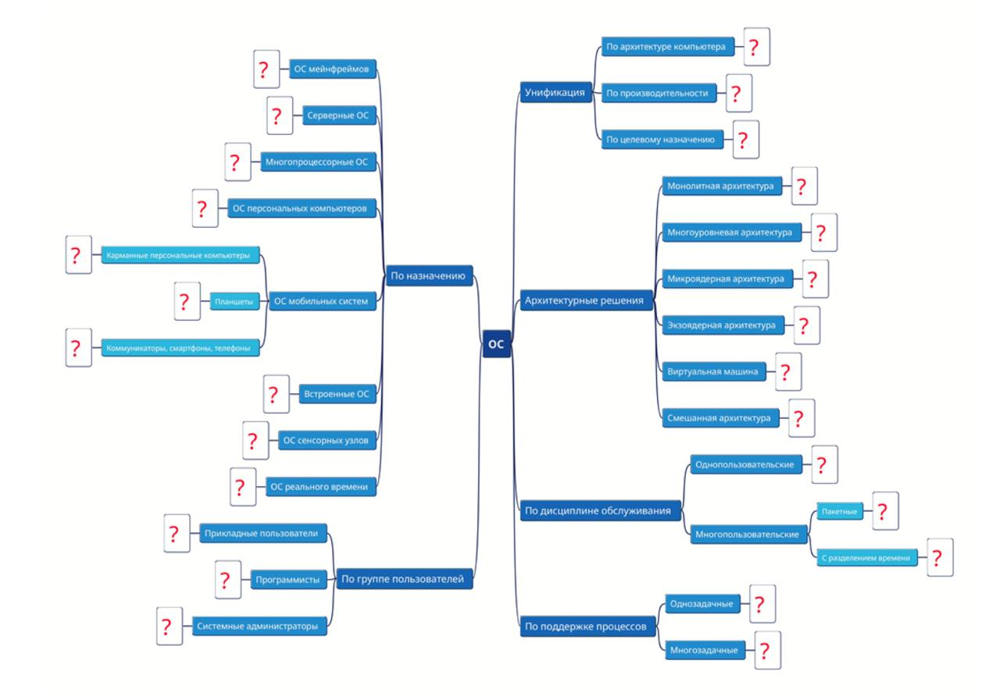

# ДЗ ПО ОС БАБУШКИН

1. Привести примеры различных ОС, привязав их к классификации, рассмотренной
на лекции. Для отличной оценки привести минимум по два варианта для всех
позиции со знаком вопроса. Для оценки на 6 баллов достаточно привести по одной
ОС для каждого критерия. Следует отметить, что одна и та же ОС может
повторяться в различных ветвях классификации.
2. Опционально плюс 1 балл. Дополнительно к представленной классификации
привести ссылки на источники информации или сайты разработчиков для ОС,
представленных в задании.
3. Опционально плюс 1 балл. Описать операционную систему, которой Вы отдаете
предпочтение и пояснить, почему она «круче» других ОС, опираясь на свои знания
навыки, используемые инструменты. Что не позволяет Вам «променять» данную
ОС на другие?

## По назначению

### ОС мейнфреймов

VM - [источник](https://ru.wikipedia.org/wiki/VM_%D0%BE%D0%BF%D0%B5%D1%80%D0%B0%D1%86%D0%B8%D0%BE%D0%BD%D0%BD%D0%B0%D1%8F_%D1%81%D0%B8%D1%81%D1%82%D0%B5%D0%BC%D0%B0)

СВМ - [источник](https://ru.wikipedia.org/wiki/%D0%A1%D0%B8%D1%81%D1%82%D0%B5%D0%BC%D0%B0_%D0%B2%D0%B8%D1%80%D1%82%D1%83%D0%B0%D0%BB%D1%8C%D0%BD%D1%8B%D1%85_%D0%BC%D0%B0%D1%88%D0%B8%D0%BD)
(советский аналог VM)

### Серверные ОС

Windows Server OS - [источник](https://www.microsoft.com/en-us/windows-server)

Ubuntu server - [источник](https://ubuntu.com/server)

## Многопроцессорные ОС

Windows Server OS - [источник](https://www.microsoft.com/en-us/windows-server)

Linux - [источник](https://www.linux.org/)

## ОС персональных компьютеров

Windows - [источник](https://www.microsoft.com/en-gb/windows/?r=1)

MacOs - [источник](https://www.apple.com/macos/macos-sequoia/)

## ОС Мобильных систем

### Карманные персональные компьютеры
те же что и первональные комьютеры

### Планшеты

IpadOs - [источник](https://www.apple.com/ipados/ipados-18/)

Android - [источник](https://www.android.com/intl/ru_ru/)

### Коммуникаторы смартфоны телефоны

IOS - [источник](https://www.apple.com/ios/ios-18/)

Аврора ОС - [источник](https://auroraos.ru/)

## Встроенные ОС

Raspberry Pi OS - [источник](https://www.raspberrypi.com/software/)

Виртуализованный маршрутизатор EcoRouter - [источник](https://ecorouter.ru/) (встроенная система в роутер)

## ОС сенсорных узлов

Contiki OS - [источник](https://www.contiki-os.org/)

TinyOS - [источник](http://www.tinyos.net/)

## ОС реального времени

VxWorks - [источник](https://www.windriver.com/products/vxworks)

QNX - [источник](https://blackberry.qnx.com/en)

# По группе пользователей

## Прикладные пользователи

Windows - [источник](https://www.microsoft.com/en-gb/windows/?r=1)

MacOs - [источник](https://www.apple.com/macos/macos-sequoia/)

## Программисты

Windows - [источник](https://www.microsoft.com/en-gb/windows/?r=1)

Linux - [источник](https://www.linux.org/)

## Системные администраторы

Linux - [источник](https://www.linux.org/)

Windows Server OS - [источник](https://www.microsoft.com/en-us/windows-server)

# Унификация

## По архитектуре компьютера

Linux - [источник](https://www.linux.org/)

Android - [источник](https://www.android.com/intl/ru_ru/)

## По производительности

Linux - [источник](https://www.linux.org/)

FreeBSD - [источник](https://www.freebsd.org/)

## По целевому назначению

Linux - [источник](https://www.linux.org/)

Windows - [источник](https://www.microsoft.com/en-gb/windows/?r=1)

# Архитектурные решения

## Монолитная архитектура

UNIX - [источник](https://unix.org/)

Novell NetWare - [источник](http://www.novell.com/documentation/nw6p/adminenu/data/a3j32go.html)

## Многоуровневая архитектура

THE Multiprogramming System - [источник](https://en.wikipedia.org/wiki/THE_multiprogramming_system)

MULTICS (Multiplexed Information and Computing Service) - [источник](https://en.wikipedia.org/wiki/Multics)

## Микроядерная архитектура

KasperskyOS - [источник](https://os.kaspersky.ru/solutions/glossary/kaspersky-thin-client/microkernel-operating-system/)

Symbian OS - [источник](https://symbianos.org/)

## Экзоядерная архитектура

Exokernel - [источник](https://pdos.csail.mit.edu/6.828/2008/readings/engler95exokernel.pdf)

Nemesis (University of Cambridge) - [источник](https://www.cl.cam.ac.uk/research/srg/netos/projects/archive/nemesis/)

## Виртуальная машина

Java Virtual Machine - [источник](https://www.java.com/en/)

WebAssembly (Wasm) - [источник](https://webassembly.org/)

## Смешанная архитектура

Linux - [источник](https://www.linux.org/)

Windows - [источник](https://www.microsoft.com/en-gb/windows/?r=1)

# По дисциплине обслуживания

## Однопользовательские ОС

MS DOS - [источник](https://ru.wikipedia.org/wiki/MS-DOS)

ОС/2 - [источник](https://ru.wikipedia.org/wiki/OS/2)

## Многопользовательские ОС

### Пакетные

IBM OS/360 - [источник](https://www.ibm.com/history/system-360)

VM - [источник](https://ru.wikipedia.org/wiki/VM_%D0%BE%D0%BF%D0%B5%D1%80%D0%B0%D1%86%D0%B8%D0%BE%D0%BD%D0%BD%D0%B0%D1%8F_%D1%81%D0%B8%D1%81%D1%82%D0%B5%D0%BC%D0%B0)

### С разделение времени

UNIX - [источник](https://unix.org/)

MULTICS (Multiplexed Information and Computing Service) - [источник](https://en.wikipedia.org/wiki/Multics)

# По поддержке процессов

## ОДнозадачные 

Windows 3.x - [источник](https://ru.wikipedia.org/wiki/Windows_3.x)

MS DOS - [источник](https://ru.wikipedia.org/wiki/MS-DOS)

## Многозадачные

Linux - [источник](https://www.linux.org/)

Windows - [источник](https://www.microsoft.com/en-gb/windows/?r=1)

----

В последнее время я дошел до идеи, что нужно иметь максимально удобный ноутбук (по клавиатуре и формфактору) не обращая внимания на его производительность и иметь дома мощный сервер, чтобы в случае необходимости подключаться к нему и проводить мощные вычисления на нем. Потихоньку привожу план в действие - пока сервер слабый, но работает.

Итак для сервера я выбрал Arch Linux, потому что это самый легковесный и нетрудозатратный. В отличии от других систем в этом дистрибутиве только минимум инструментов, что особенно важно на данном этапе (сервер слабый). Тем временем это Linux, поэтому на нем есть большое количество уже работающего софта для программистов.
