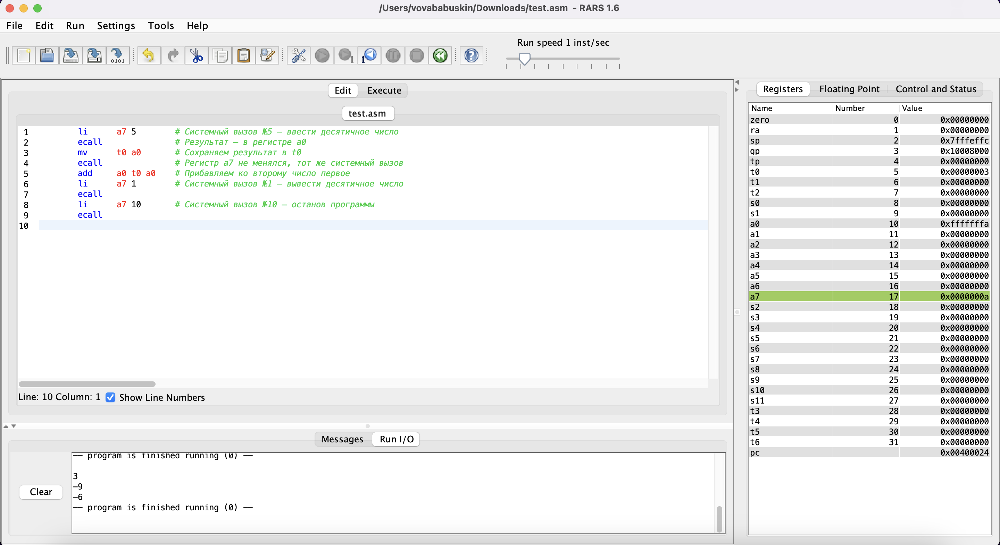
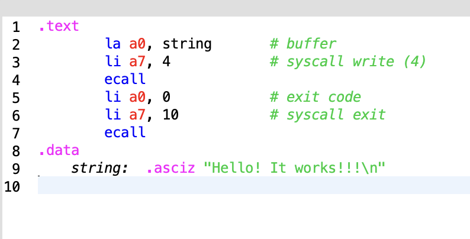
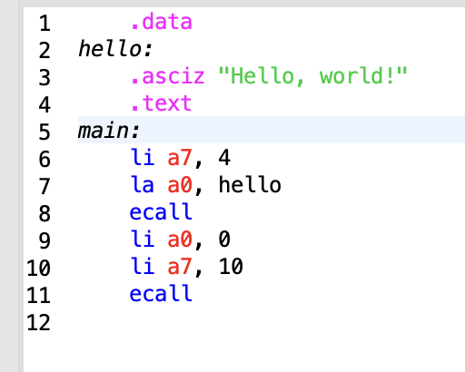
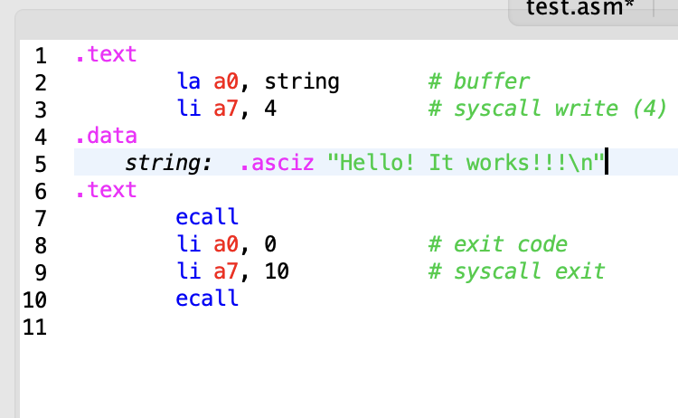
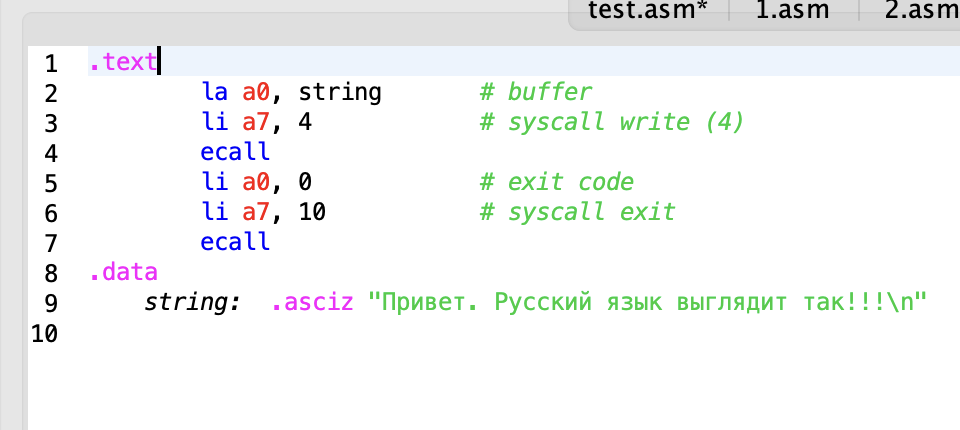
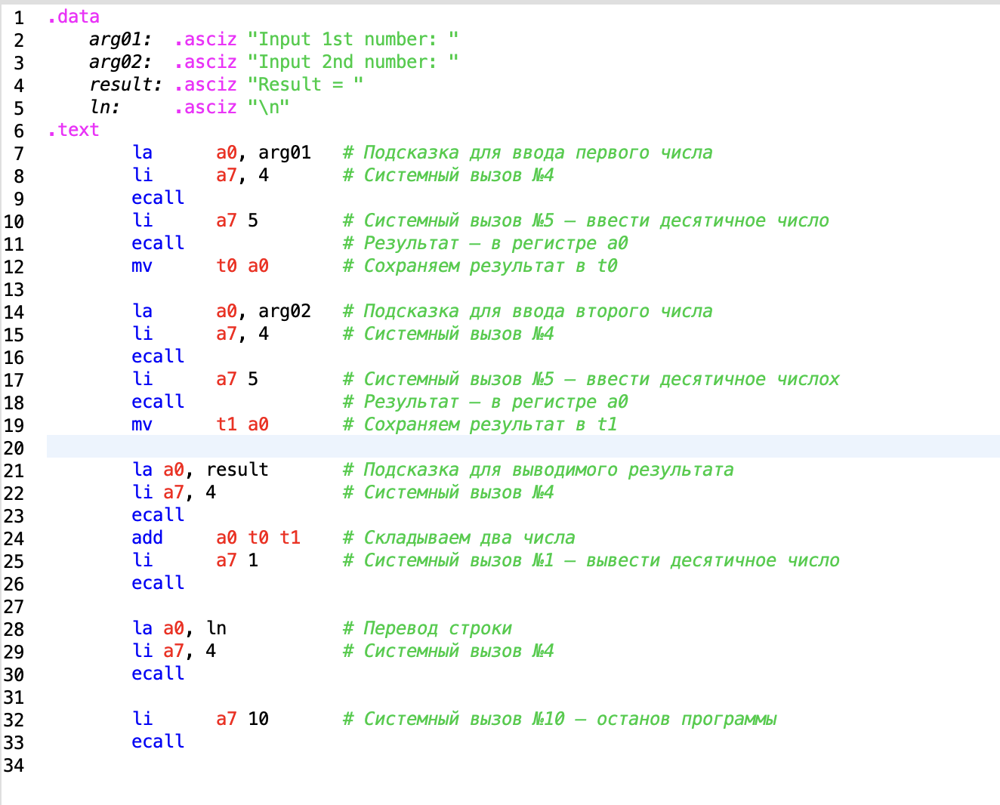

# Бабушкин Владимир Александрович 

## АВС ОТЧЕТ 1

### задача 1 A + B

Первым делом я запустил код с семинара, чтобы опробовать систему



Предварительно уменьшил ползунок скорости, чтобы успевать смотреть каждый шаг

Программа выполнилась верно, идем дальше

### задача 2 ВЫВОД



Как я понял:

Секция ```.text ``` обозначает что в этом блоке будет находится сама программа


Секция ```.data ``` обозначает что в этом месте программы будут описываться данные

```.asciz``` означает что в конце следующего набора символов нужно добавить ```NULL```, тем самым обьяснить программе что строка закончена
 
программа копирует строку в ```a0``` и выводит ее,
после этого очищает ```a0``` и завершает программу последними двумя строчками.

### задача 3 Другой Вывод



здесь мы делаем по сути то же самое, только данные строки поставили в началор программы.

Еще была проблема с запуском, я дописал завершение программы.

### задача 4 Еще один вариант вывода



Данные можно поместить и посреди основной программы

### задача 5 Вывод на русском



```RISC-V asm``` поддерживает и ```UTF_16```, значит можно выводить строки на русском.

### задача 6 Красивое A+B



поделим код на блоки 

```1-5``` данные вывода

```7-9``` просим пользователя ввести число

```10-12``` считываем число

```14-16``` просим ввести второе число

```17-19``` считываем второе число

```21-23``` выводим подсказку для результата

```24-26``` считаем сумму и выводим ее

```28-30``` переводим строку

```32-34``` заканчиваем программу


### Итог

1)поделим команды, которые мы использовали, на команды и псевдокоманды:

команды:

```ecall, add```

псевдокоманды:

```li, la, mv```

2)давайте, распишим типы команд для одной из представленных программ(для первой):


```li``` это команда типа I (непосредственное значение-регистр-регистр потому что на самом деле это ```addi```)

```ecall``` команда I (непосредственное значение-регистр-регистр)

```mv``` команда R(регистр-регистр-непосредственное значение потому что на самом деле это ```add```)

```add``` команда R


3)рассмотрим системные вызовы, которые мы используем в программах

```5``` вводит десятичное число

```1``` выводит десятичное число

```10``` завершает программу с кодом 0

```4``` выводит строку


