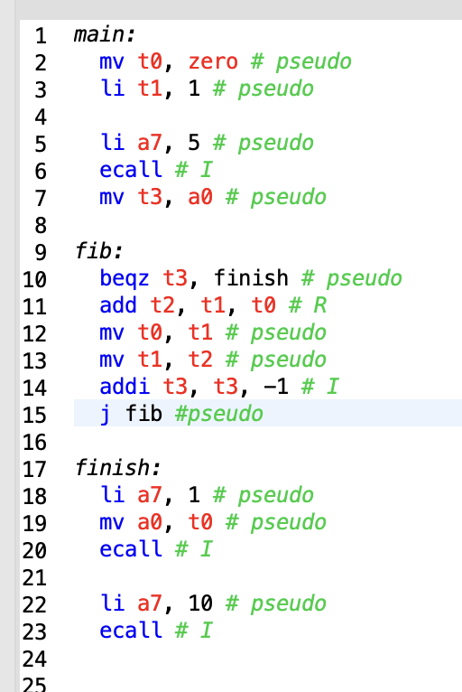
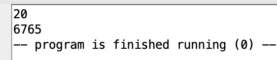

# Otchet 2


## Базовое задание



перписал текст программы, и к каждой инструкции добавил формат или написал что это псевдоинструкция.

через это окно смотрел является ли инструкция псевдоинструкцией


результат выполнения:




## задание на 10 баллов

покопавшись в документации в самом RARS я нашел команду 
```
java -jar rars.jar h
```

благодаря которой я нашел

```
dump <segment> <format> <file> -- memory dump of specified memory segment
            in specified format to specified file.  Option may be repeated.
            Dump occurs at the end of simulation unless 'a' option is used.
            Segment and format are case-sensitive and possible values are:
            <segment> = .text, .data, or a range like 0x400000-0x10000000
            <format> = SegmentWindow, HexText, AsciiText, HEX, Binary, BinaryText
```

Значит есть читаемый формат SegmentWindow (в документации внутри RARS о нем ничего не написано)


благодаря этой команде я ассемблировал код из терминала без запуска


В ```hexcode.txt.``` лежит


форматы базовых команд я отметил и так, поэтому отмечу форматы оригинальных команд для псевдокоманд

итог

