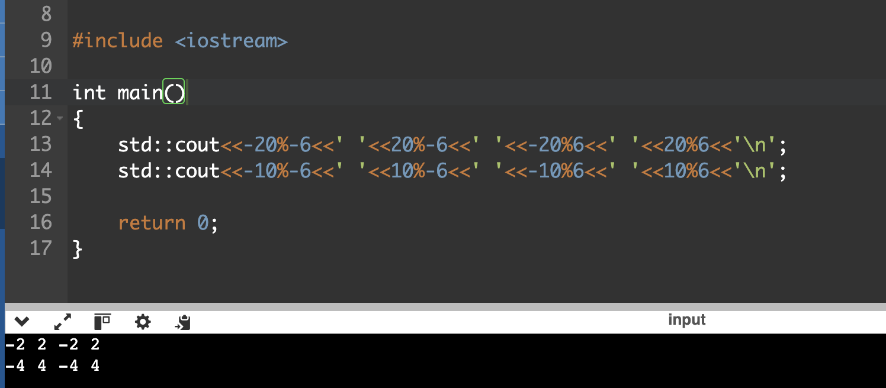
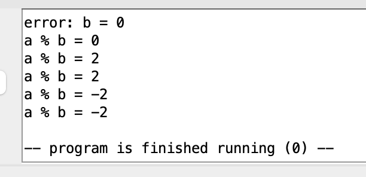

# OTCHET 3

## на 8 баллов

для начала я изучил как работает остаток от деления в c++



как мы видим

```cpp
a % b = (abs(a) % abs(b)) sgn(a)

```

я написал вот такой код (файл mod8.asm в этой же папке)

```asm
.data
arg1: .asciz "Input a: "
arg2: .asciz "Input b: "
result: .asciz "a % b = "
err: .asciz "error: b = 0"
endl: .asciz "\n"

.text
#input
la a0,arg1
li a7, 4
ecall
li a7 5
ecall 
mv t0, a0

la a0,arg2
li a7, 4
ecall
li a7 5
ecall 
mv t1, a0

# обработка введенных данных
beqz t1, errorcase

li t2, 1
bltz t0, calz
p1:
bltz t1, cblz
p2:

# вычисление результата
ble t1, t0, divs

# вывод результата
j resultofprogram

divs:
neg t1,t1
add t0,t0,t1
neg t1, t1
ble t1, t0, divs
j resultofprogram


resultofprogram:
la a0, result
li a7 4
ecall
mv a0, t1
mul a0, t0, t2
li a7, 1
ecall
j killprogram

calz: # case 'a' less zero
li t2, -1
neg t0,t0
j p1

cblz: #case 'b' less zero
li t3, -1
neg t1, t1
j p2

errorcase:
la a0, err
li a7, 4
ecall
j killprogram

killprogram:
la a0, endl
li a7, 4
ecall
li a7, 10
li a0, 0
ecall
```
вот что я храню в регистрах

t0 - a, и его же уменьшаю, ответ получится именно в этом регистре

t1  - b

t2 - знак a

t3  - знак b

Результат работы программы по тестовых случаях

```
Input a: 20
Input b: 20
a % b = 0

-- program is finished running (0) --


Reset: reset completed.

Input a: 20
Input b: 0
error: b = 0

-- program is finished running (0) --


Reset: reset completed.

Input a: 20
Input b: 6
a % b = 2

-- program is finished running (0) --


Reset: reset completed.

Input a: 20
Input b: -6
a % b = 2

-- program is finished running (0) --


Reset: reset completed.

Input a: -20
Input b: -6
a % b = -2

-- program is finished running (0) --


Reset: reset completed.

Input a: -20
Input b: 6
a % b = -2

-- program is finished running (0) --
```


я загружал текстом вместо скринов, чтобы было читаемо и не было 100500 картинок
## на оценку 10
тесты расписываются в начале таким образом

```
test1:
li t0, 20
li t1, 0
li t4,0
j analys_parameters
test2:
li t0, 20
li t1, 20
li t4,1
j analys_parameters
test3:
li t0, 20
li t1, 6
li t4,2
j analys_parameters
test4:
li t0, 20
li t1, -6
li t4,3
j analys_parameters
test5:
li t0, -20
li t1, 6
li t4,4
j analys_parameters
test6:
li t0, -20
li t1, -6
li t4,5
j analys_parameters
```

Полный код программы в файле mod10.asm

я добавил в код в самом конце проверку на номер тест, исходя из которой прыгал обратно вверх

```
#return to tests
li t5, 0
beq t4,t5, test2
li t5, 1
beq t4,t5, test3
li t5, 2
beq t4,t5, test4
li t5, 3
beq t4,t5, test5
li t5, 4
beq t4,t5, test6
```

результат вывода программы



как мы видим тесты выполнились как в c++, программа работает корректно