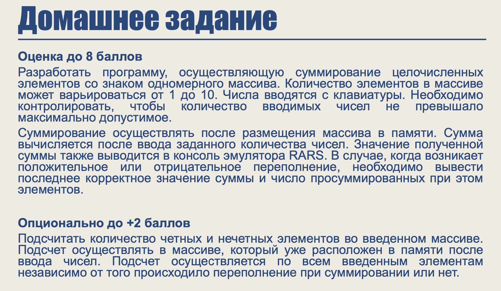

# Отчет 4

## 8 баллов
[ссылка на код задачи на 8 баллов](https://github.com/Babushkin05/HSE-ABC-OS-course/blob/main/seminar%204/sum_of_array8.asm)

в коде написано комментарии, по которым можно понять что делает тот или иной блок.

## 10 баллов

